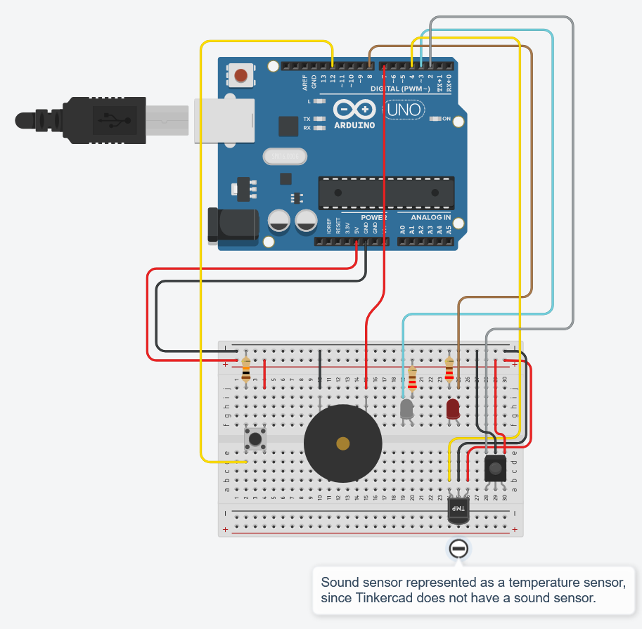

# Clap/timer TV remote
Our PPC final assignment :)

Turn your TV on and off by clapping or by setting a timer.
# Component List

|Name       |Quantity|Component                  |
|-----------|--------|---------------------------|
|U1         |1       | Arduino Uno R3            |
|UIR-Sensor |1       | IR sensor                 |
|DIR-LED    |1       |Infrared LED               |
|R1, R2     |2       |220 Ω Resistor             |
|DLED       |1       |Red LED                    |
|USoundSnsr |1       | Sound Sensor              |
|PIEZOBuzzer|1       | Buzzer                    |
|S1         |1       | Pushbutton                |
|R4         |1       |10 kΩ Resistor             |

# Circuit

**[Schematics PDF](Schematics.pdf)**
